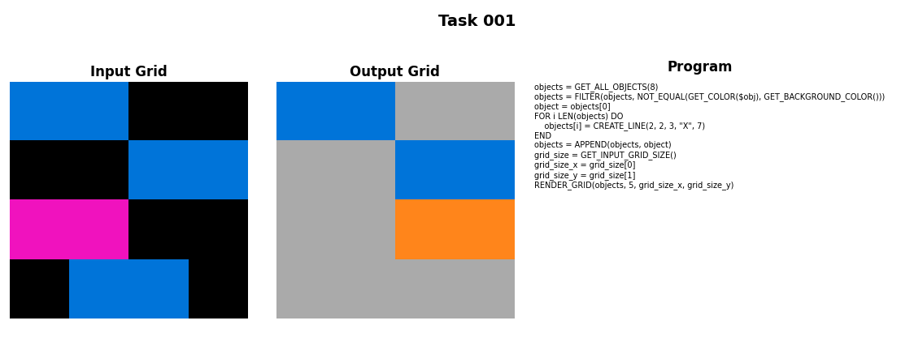
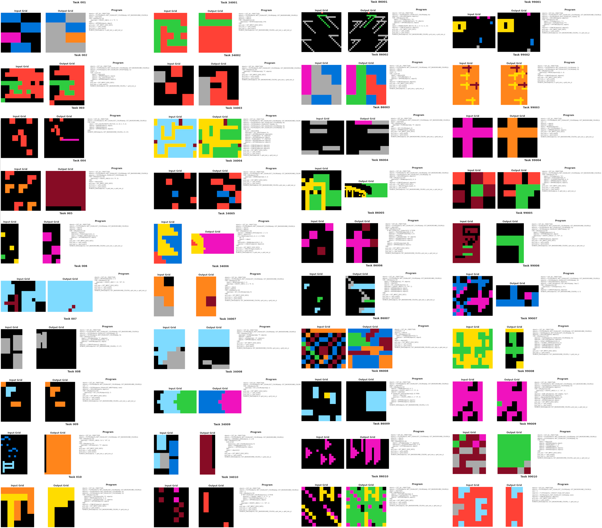
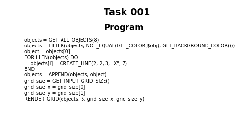

# ArcPrize2025 Hybrid Solver

📄 **Japanese version** → [README.ja.md](README.ja.md)

A hybrid solver for the **ARC Prize 2025 (ARC-AGI2)** benchmark.
This project integrates a rule-based DSL runtime with a neural program-synthesis model, supporting end-to-end workflows for **data generation, training, and inference**.

---

## Table of Contents

* [Project Overview](#project-overview)
* [Key Features](#key-features)
* [Background and Goals](#background-and-goals)
* [Custom DSL Overview](#custom-dsl-overview)
* [Extended Dataset Generation Pipeline](#extended-dataset-generation-pipeline)
* [Neural Inference Pipeline (with Rule-based Assistance)](#neural-inference-pipeline-with-rule-based-assistance)
* [Directory Structure](#directory-structure)
* [Environment Setup](#environment-setup)
* [Assets Not Included](#assets-not-included)
* [Dataset Placement](#dataset-placement)
* [Main Scripts](#main-scripts)
* [Recommended Workflow](#recommended-workflow)
* [Code Quality and Testing](#code-quality-and-testing)
* [License](#license)

---

## Project Overview

* Unified solver for ARC-AGI2 research, developed for the ARC Prize 2025.
* Integrates a custom DSL runtime, program-synthesis neural model, evaluation logic, and data generation tools.

---

## Key Features

* **DSL Runtime:** Fully custom DSL engine with parser, interpreter, and executor under `src/core_systems`.
* **Neural Inference (with Rule-based Assistance):** Neural program synthesis as the primary method, with rule-based object matching for partial program generation as assistance in `src/hybrid_system`.
* **Dataset Tools:** Includes validation, quality control, and visualization aligned with ARC-AGI2 standards.
* **Logging & Utilities:** Rich experiment management and inspection tools in `scripts/`.
* **End-to-End CLI:** Unified command-line interface for data generation, training, and verification.

---

## Background and Goals

* Combine symbolic reasoning (DSL) and neural program synthesis for solving ARC Prize 2025 tasks.
* Extend expressiveness and interpretability through a hand-crafted DSL architecture.
* Support large-scale synthetic dataset generation for model generalization.
* Provide a modular, reproducible, and deployable codebase for both local and cloud GPU environments.

---

## Custom DSL Overview

* Located in `src/core_systems`: includes tokenizer, parser, executor, and supporting utilities.
* 89+ drawing and transformation commands defined in `operations`.
* `grid_manager` handles spatial integrity, collisions, and color management.
* `interpreter` and `tokenizer` directly bridge DSL tokens with the neural synthesis model.



---

## Extended Dataset Generation Pipeline

* Implemented in `src/data_systems/generator` and orchestrated via `scripts/production/data_generation/generate_data.py`.
* Balances randomness and constraints (difficulty, grid size, color distribution) through probabilistic rules.
* DataPairs (DSL + grid pairs) stored as compressed `.jsonl.gz` files, streamed with `DataIO`.
* Analysis scripts in `scripts/analysis/` enable data quality and training trend analysis.



---

## Neural Inference Pipeline (with Rule-based Assistance)

* Managed under `src/hybrid_system/inference`, handling candidate generation, execution, and scoring loops.
* Neural models use `ProgramTokenizer` with beam search and temperature control.
* The DSL runtime evaluates each candidate, and `SystemIntegrator` scores outputs.
* Rule-based assistance (object matching for partial program generation) enhances robustness.
* All experiment logs and visual outputs are reproducible via CLI commands.



---

## Directory Structure

```
ArcPrize2025/
├── configs/                    # Shared configuration files
├── data/                       # ARC-AGI2 official and generated datasets
│   ├── core_arc_agi2/          # Official ARC-AGI2 datasets
│   └── generated/              # Generated data (excluded from Git)
├── scripts/                    # Scripts
│   ├── production/             # Production scripts
│   │   ├── data_generation/    # Data generation
│   │   ├── training/           # Training
│   │   └── inference/          # Inference
│   ├── testing/                # Test scripts
│   ├── verification/           # Verification scripts
│   ├── analysis/               # Analysis scripts
│   └── utils/                  # Utilities
├── src/                        # Source code
│   ├── core_systems/           # DSL runtime
│   ├── data_systems/           # Data generation and management
│   └── hybrid_system/          # Neural inference system (with rule-based assistance)
├── docs/                       # Documentation
├── command_quick_reference.ja.md  # DSL command reference (Japanese)
└── command_quick_reference.md     # DSL command reference (English)

# Excluded from Git (.gitignore)
├── logs/                       # Log files
├── models/checkpoints/         # Trained models
├── outputs/                    # Output files
└── learning_outputs/           # Training intermediate outputs
```

---

## Environment Setup

1. Use **Python 3.11** (tested on 3.11.9).
2. Create and activate a virtual environment (`.\.venv\Scripts\Activate.ps1` on PowerShell).
3. Install dependencies:

   ```bash
   pip install -r requirements.txt
   ```
4. For GPU support, ensure PyTorch matches your CUDA driver version.

---

## Assets Not Included

* Official ARC-AGI2 JSON datasets.
* Generated DataPairs, trained checkpoints, and logs (regenerate locally as needed).
* CUDA-enabled PyTorch binaries (install separately according to your environment).

---

## Dataset Placement

* Download the ARC-AGI2 official JSON files (e.g. `arc-agi_training_challenges.json`) and place them in `data/core_arc_agi2/`.
* Generate synthetic datasets using `scripts/production/data_generation/generate_data.py`.
* Large files (generated data, trained models, logs) are excluded from Git via `.gitignore`.

---

## Main Scripts

### Production Scripts (`scripts/production/`)

| Script | Purpose |
|--------|---------|
| `data_generation/generate_data.py` | Generate Phase1 DataPairs |
| `data_generation/generate_program_scorer_data.py` | Generate ProgramScorer training data |
| `training/train_all_models.py` | Unified training pipeline for all models |
| `training/train_program_synthesis.py` | Train program synthesis model |
| `training/train_object_based.py` | Train object-based model |
| `training/train_program_scorer.py` | Train ProgramScorer model |
| `inference/inference.py` | Run inference with trained models |
| `inference/benchmark_program_synthesis.py` | Benchmark program synthesis engine |

### Testing & Verification Scripts

| Script | Purpose |
|--------|---------|
| `testing/test_training_quick.py` | Quick GPU test run |
| `verification/` | Data validation and integrity checks |
| `analysis/` | Data analysis and statistics |

---

## Recommended Workflow

1. **Environment Setup** → Create virtual environment and install dependencies.
2. **Generate Data** → Run `scripts/production/data_generation/generate_data.py`.
3. **Dry Run** → Test with `scripts/testing/test_training_quick.py`.
4. **Full Training** → Run `scripts/production/training/train_all_models.py` or individual training scripts.
   - Logs saved to `logs/`, checkpoints to `models/checkpoints/` (excluded from Git).
5. **Run Inference** → Evaluate tasks with `scripts/production/inference/inference.py`.

---

## Code Quality and Testing

* Core training and inference modules: `src/hybrid_system/learning` and `src/hybrid_system/inference`.
* DSL stack provides step execution, debugging snapshots, and logging.
* QA and data validation modules in `src/data_systems` ensure dataset consistency.

---

## License

* ARC-AGI2 datasets are governed by their original license and must be obtained separately.
* Generated datasets and trained models may be large; consider Git LFS or external storage.
* Default config assumes CUDA (`torch==2.5.1+cu121`).
  To run on CPU, set `device: cpu` in `configs/default_config.yaml`.

---